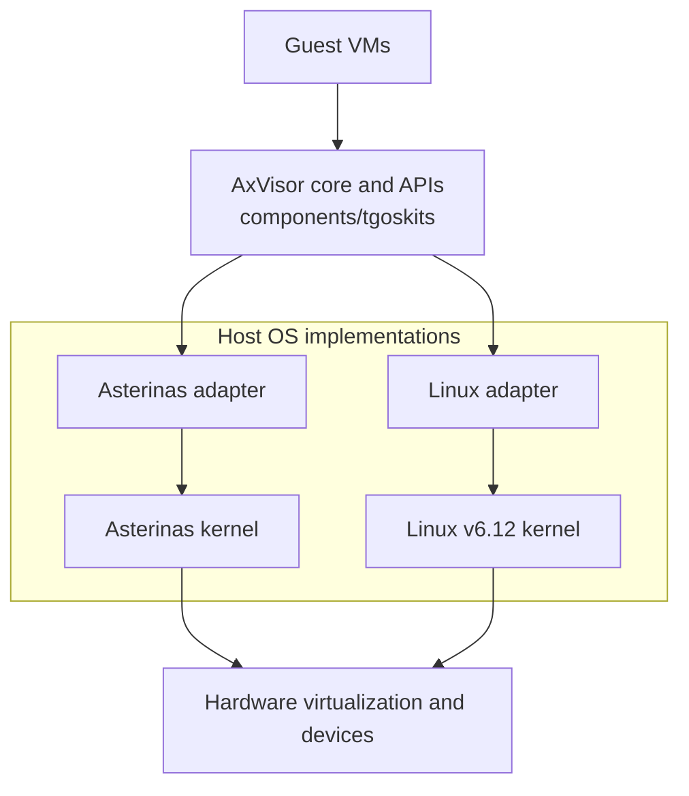

# FreeHypervisor

This repository provides a reproducible workspace for FreeHypervisor. It pins
the shared AxVisor components and the two host OS implementations as Git
submodules.

```text
components/tgoskits/  Shared AxVisor core and APIs
hosts/asterinas/      Asterinas host implementation
hosts/linux/          Linux v6.12 host implementation
```

## Architecture



## Getting Started

Clone and initialize the workspace with:

```bash
git clone --recurse-submodules https://github.com/Ivans-11/freehypervisor.git
cd freehypervisor
git submodule update --init --recursive
```

The recorded submodule commits form the reproducible project snapshot. For
development, switch each submodule to its corresponding branch:

```bash
git -C components/tgoskits switch axvisor-core
git -C hosts/asterinas switch axvisor-host
git -C hosts/linux switch freehypervisor
```

## Testing

The following examples directly boot a Linux guest on each host:

Run each example from the workspace root.

AxVisor on ArceOS:

```bash
cd components/tgoskits
cargo xtask axvisor test qemu --arch riscv64
```

AxVisor on Asterinas:

```bash
cd hosts/asterinas
./tools/axvisor test --arch riscv64 --mode static --guest linux
```

AxVisor on Linux:

```bash
cd hosts/linux/tools/axvisor
./run-case.sh --case riscv64-static-linux
```

Use `./tools/axvisor --help` in Asterinas and `./run-case.sh --list` in Linux
to inspect the available test cases. x86_64 tests require hardware
virtualization support.

When shared components change, commit `tgoskits` first, update and test both
host implementations, then commit the updated submodule pointers here.
